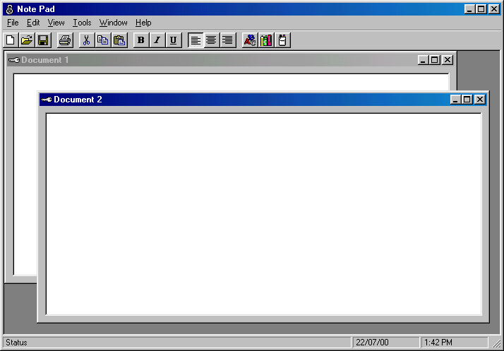



## Encrypted Note Pad

### Description

Demonstrates how to make a simple noptepad that supports encryption. The notepad supports fonts, colours, sizes etc. Demonstrates how to encrypt stuff using the Xor operator. Also show how to use MDI.
 
### More Info
 

             |
---                |---
**Submitted On**   |2000-07-22 13:36:40
**By**             |[mike](https://github.com/Planet-Source-Code/PSCIndex/blob/master/ByAuthor/mike.md)
**Level**          |Intermediate
**User Rating**    |4.0 (12 globes from 3 users)
**Compatibility**  |VB 6\.0
**Category**       |[Encryption](https://github.com/Planet-Source-Code/PSCIndex/blob/master/ByCategory/encryption__1-48.md)
**World**          |[Visual Basic](https://github.com/Planet-Source-Code/PSCIndex/blob/master/ByWorld/visual-basic.md)
**Archive File**   |[CODE\_UPLOAD80157212000\.zip](https://github.com/Planet-Source-Code/mike-encrypted-note-pad__1-9957/archive/master.zip)

